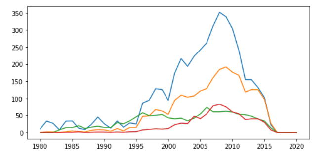
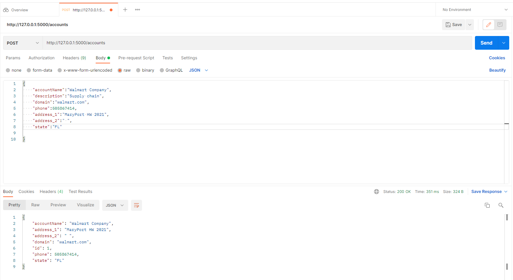
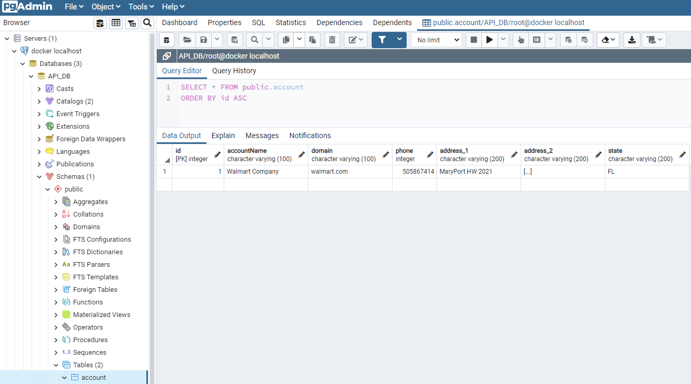
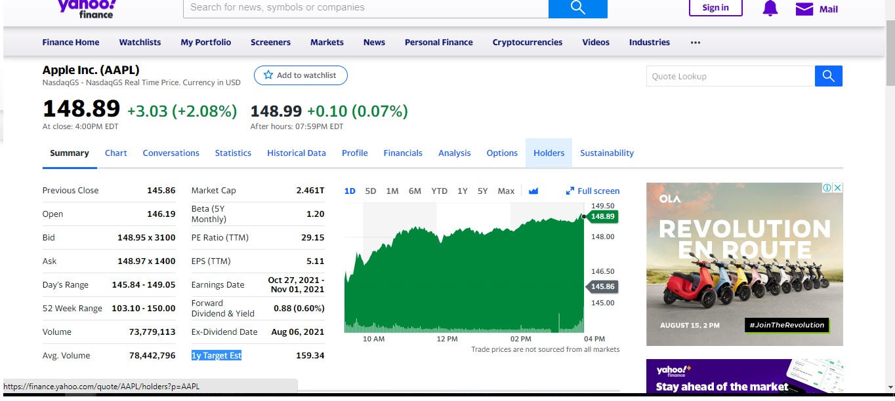
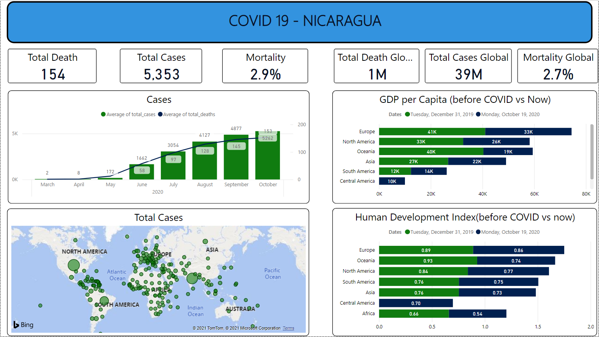
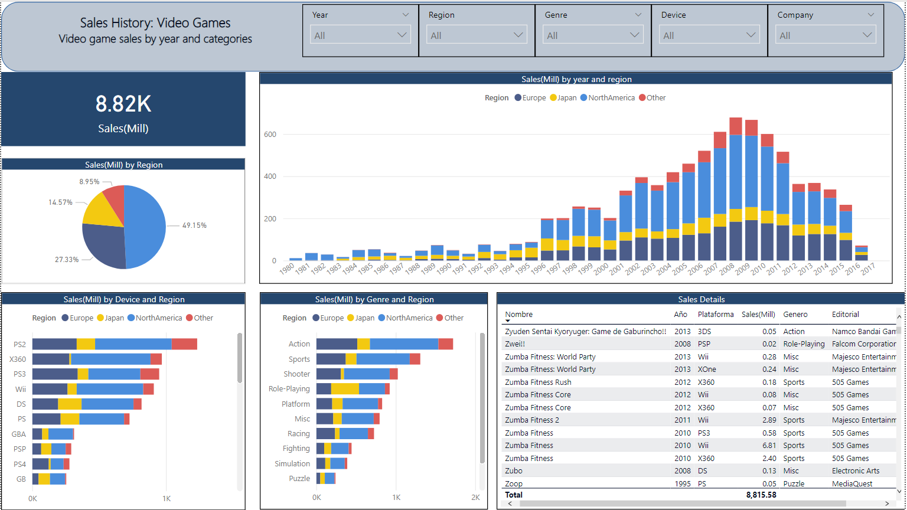

# Ricardo's Portfolio - Data Engineer | Data Analyst portfolio

Portfolio containing projects in Python, SQL, KDB+/Q and Power Bi.

# [Project 1: Analyze data using KDB+/Q and embedpy](https://github.com/MrRicardoAcuna7/KDBQ_analyze_videgames_sales_data)
Analyze videogame sales data from CSV to KDB+/Q language and visualize result

1. Import data from CSV file to KDB+ as KDB+ table.
2. Cleaning table removing null values in QSQL functional and QSQL.
2. Querying table using multiple functions.
3. Using Embedpy get a visualization of sales by region.
4. Create a dynamic function using parse tree of QSQL(QSQL functional).
  
[See Notebook here](https://github.com/MrRicardoAcuna7/KDBQ_analyze_videgames_sales_data/blob/main/analyze_vgsales.ipynb)

# [Project 2: ETL (Geting data from public API) + visualization using KDB+/Q](https://github.com/MrRicardoAcuna7/ETL_CryptoCoins)
Call get from public API, it becomes into a dictionary easy to parse, all in one line.  

1. Utilize .j.k and to parse JSON format to KDB+ dictionary, .q.hg which is getting command of the API endpoint.  
2. Use of some functions (iterators, flip command, etc) to select element in the dictionary and transform it into a table.  
3. Get a list of columns fields to graphic using embedpy.  
[See Notebook here](https://github.com/MrRicardoAcuna7/ETL_CryptoCoins/blob/main/CryptoCurrencies_ETL_Analysis.ipynb)

# [Project 3: API conecting to postgres](https://github.com/MrRicardoAcuna7/API_Postgres_Flask)
This is aN API done using Flask and Postgres, the example is for communicating your API with an account table.

1. Set up the app through Flask, and create connection with postgres using app.config['SQLALCHEMY_DATABASE_URI'].
2. Create the meta for the new table that would store the data and using SQLAlchemy create_all() would create it.
3. Create for each method a function to read the input and push to postgres. The endpoint should be localhost:5000/accounts for method POST.
4. Test it with POSTMAN sending one entry in JSON format.

6. Check that table in postgres.
 

# [Project 4: API that connect with local JSON file](https://github.com/MrRicardoAcuna7/local_API_server)
Simple project in Python using Flask library, that supports REST API methods using a product table in JSON format.

1. Create an HTTP handler to return all messages through a JSON coder.   
2. Call methods(POST,PUT,DELETE) to declare function.  
3. Set up the server connection in a local port.  

# [Project 5: Web Scraping Yahoo Finance using Python](https://github.com/MrRicardoAcuna7/WebScraping_Finance_Apple)
1. Get data from yahoo finance using python Framework Scrapy, through xpath expressions.  
2. Extract most import economic metrics of Apple and getting the extraction date.  
3. Export output to CSV file.  
  

# [Project 6: Covid Dashboard](https://github.com/MrRicardoAcuna7/PowerBIProjects)
1. Create a Power BI template with covid data from October 2020.  
2. Analyze trend cases vs total death in Nicaragua and global.  
3. Analyze economic impact in important metrics(HDI and GDP). 

# [Project 7: Videogame - Sales Trends](https://github.com/MrRicardoAcuna7/PowerBIProjects)
1. Create a Power BI template with videogames data.  
2. Analyze videogame sales in different ways.  
3. Analyze sales through all years to analyze any trend.   
  

# [Project 8: AdventureWorks Data Base SQL - Analysis](https://github.com/MrRicardoAcuna7/AdventureWorks2019DB_SQL_Analysis)
1. Download and restore database in Sql Server Management Studio.  
2. Create a temporary table that stores a clean dataset.  
3. Get values by different fields.  

# [Project 9: KDB IPC - Read from sql connection and get output tables through an ipc connection](https://github.com/MrRicardoAcuna7/KDB-QIPC)
1. Open KDB+ ODBC connection using DSN and execute queries.  
2. Set up KDB+ messages and permissions for IPC.  
3. Create the function to be called.
4. On the client side, execute async ipc call and store the output as a KDB+ table in a local directory.  

# [Project 10: KAFKA Sending messages from producer to consumer](https://github.com/MrRicardoAcuna7/Kafka_Python_Code)
1. Runs kafka and zookeper in a docker container.  
2. Created a Python script for creating random messages.  
3. Created a kafka producer to send messages.
4. Set up a kafka consumer to parse and read the message.  

# [Project 11: Community Project-Creating a complete pipeline](https://github.com/MrRicardoAcuna7/data_engineering_zoomcamp)
1. Creates docker-compose file for postgres, pgadmin communicating with each other.
2. Set up postgres to mount in local the data. 
3. Python script that would iterate in chunk data and push to postgres.
4. Created a docker-compose to run the python with parameters. 

